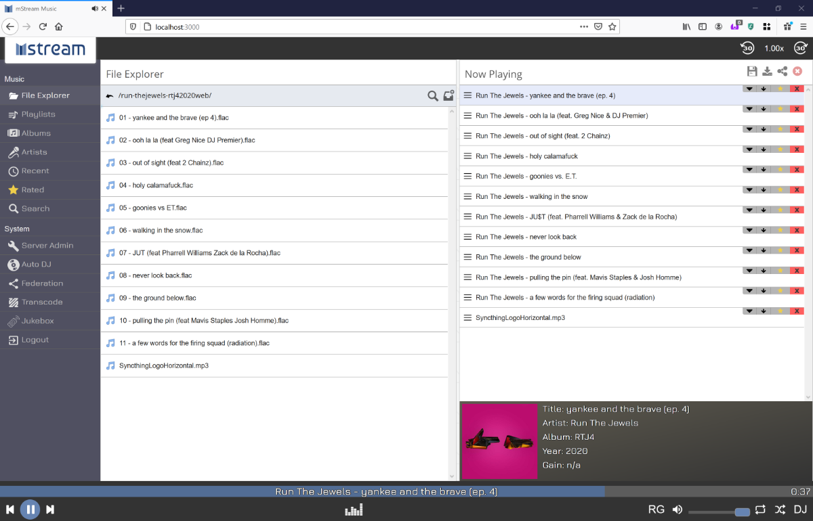

<!--
N.B.: This README was automatically generated by https://github.com/YunoHost/apps/tree/master/tools/README-generator
It shall NOT be edited by hand.
-->

# mStream pour YunoHost

[](https://dash.yunohost.org/appci/app/mstream)  

[](https://install-app.yunohost.org/?app=mstream)

*[Read this readme in english.](./README.md)*

> *Ce package vous permet d’installer mStream rapidement et simplement sur un serveur YunoHost.
Si vous n’avez pas YunoHost, regardez [ici](https://yunohost.org/#/install) pour savoir comment l’installer et en profiter.*

## Vue d’ensemble

mStream est un serveur de streaming musical personnel. Vous pouvez utiliser mStream pour diffuser votre musique depuis votre ordinateur personnel vers n'importe quel appareil, n'importe où.

### Caractéristiques

- Économe en mémoire et en CPU
- Testé sur des bibliothèques multi-téraoctets
- Fonctionne sur des cartes ARM comme le Raspberry Pi

**Version incluse :** 5.11.4~ynh1

**Démo :** https://demo.mstream.io/

## Captures d’écran



## Documentations et ressources

* Site officiel de l’app : <https://mstream.io/>
* Dépôt de code officiel de l’app : <https://github.com/IrosTheBeggar/mStream>
* YunoHost Store: <https://apps.yunohost.org/app/mstream>
* Signaler un bug : <https://github.com/YunoHost-Apps/mstream_ynh/issues>

## Informations pour les développeurs

Merci de faire vos pull request sur la [branche testing](https://github.com/YunoHost-Apps/mstream_ynh/tree/testing).

Pour essayer la branche testing, procédez comme suit.

``` bash
sudo yunohost app install https://github.com/YunoHost-Apps/mstream_ynh/tree/testing --debug
ou
sudo yunohost app upgrade mstream -u https://github.com/YunoHost-Apps/mstream_ynh/tree/testing --debug
```

**Plus d’infos sur le packaging d’applications :** <https://yunohost.org/packaging_apps>